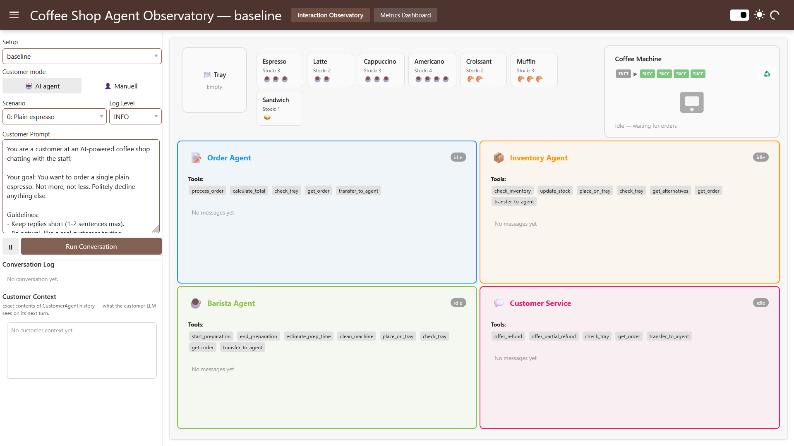

# Agentic Coffee Shop
A multi-agent coffee shop for exploring LLM agent behavior. Five specialized agents (Order, Inventory, Barista, Customer Service, and a Customer that drives the conversation) collaborate in a LangGraph Swarm. Interactions are traced via MLflow and can be exported as event logs for process mining.



Two entry points: a CLI for headless trace generation and a Panel-based dashboard for live observation and metrics.

## Requirements

- Python >= 3.13
- [Poetry](https://python-poetry.org/) (recommended) or pip with `requirements.txt`
- An API key for a [LangChain-supported LLM provider](https://python.langchain.com/docs/integrations/chat/#featured-providers), or a local Ollama runtime

## Installation

```bash
poetry install
poetry env activate                          # or prefix commands with `poetry run`
pip install "langchain[openai]<1.0.0"        # or [anthropic], etc.
cp .env.example .env                         # set LLM_PROVIDER (default: ollama)
```

Optional pre-commit hook (runs `ruff check` / `ruff format`; CI enforces the same):

```bash
pip install pre-commit && pre-commit install
```

## Setups

A **setup** is a self-contained configuration of agents, guardrails, and guidelines under `config/setups/<name>/`. The `baseline` setup is the default for both `simulate` and `dashboard`. Guardrail predicate *logic* lives in [src/control_plane/predicates.py](src/control_plane/predicates.py) and is referenced by name from YAML — varying `predicate_args` is a YAML-only change.

The catalogue spans *no rules* to *hostile rules* so you can compare the same swarm under different control-plane pressure.

Reference points:

- `unconstrained` — full handover graph, no guardrails, no guidelines. Maximum freedom.
- `baseline` — linear handovers, `deny` lifecycle gates enforce the order state machine, agents told a supervisor is watching.
- `all_handovers` — full handover graph plus an `order_id_in_handoff` guardrail once an order exists.

Baseline policy family:

- `sensible_ranges` — `deny` caps on order size, total, discount, partial refund. Outliers blocked, happy path unaffected.
- `sensible_ranges_flag` — same caps in `flag` (observe-only) mode. Useful for sizing a cap before enforcing it.
- `overconstrained` — caps cranked so tight that normal business fails. Demonstrates over-tight governance.
- `baseline_flag` — every `baseline` guardrail in `flag` mode. Agents behave as unconstrained; violations still logged.
- `anti_flow` — lifecycle gates inverted + severed barista handover; orders trapped mid-flow. Worst-case misconfiguration.
- `strict_flow` — linear pipeline plus `process_order_once_per_conversation` (via `max_tool_calls` predicate).

List available setups: `poetry run simulate --list-setups`.

Add a new setup:

```bash
cp -r config/setups/baseline config/setups/my_setup
# edit config/setups/my_setup/{agents,guardrails,guidelines}/*.yaml
```

## Headless Simulation

```bash
poetry run simulate                            # 1 random trace, baseline setup is default
poetry run simulate --setup baseline --traces 10 --scenario all # cycle all scenarios
poetry run simulate --setup baseline --traces 5 --scenario 2    # specific scenario
poetry run simulate --setup baseline --traces 10 --export-logs  # also emit event log CSV
```

Other flags: `--quiet`, `--log-level {debug,info,warning,error}`.
Run `poetry run simulate --help` for all options.


Repeat `--setup` to run multiple setups in one invocation (`--setup baseline --setup all_handovers`).

Scenarios (`0`–`6`, or `all` / `random`) are defined in `src/agents/customer_agent.py` (`CUSTOMER_SCENARIO_DEFS`) — the single source of truth for both label and prompt.

For mixing setups and scenarios in one run, use the `--batches` parameter:

```bash
# --batches setup:scenario:traces
poetry run simulate --batches baseline:0:10 unconstrained:2:10  # runs 10x scenario 0 setup baseline and 10x scenario 2 setup unconstrained 
``` 
Toggles: `--reset-inventory`, `--process-supervisor`, `--export-logs` (each with `--no-...` variants). Batches sharing a setup reuse the same `CoffeeShop` instance — keep same-setup entries consecutive.

### Experiment sweeps

`--batches` runs everything in one process, which is fine for a handful of traces but not for a full
setup × scenario grid: the coffee-shop SQLite carries orders from cell to cell, and a single crash
takes the whole run with it. `scripts/run_experiment.py` drives the grid as one isolated `simulate`
process per (setup, scenario) cell:

```bash
poetry run python scripts/run_experiment.py --help                              # all options + explanations

poetry run python scripts/run_experiment.py --dry-run                           # print the grid, run nothing
poetry run python scripts/run_experiment.py --setups baseline --scenarios 1 --count 2   # pilot
poetry run python scripts/run_experiment.py                                     # 6 setups x 4 scenarios x 50
poetry run python scripts/run_experiment.py --resume experiment_runs/<dir>      # continue after an interrupt
```

Before every cell it deletes `coffee_shop.db` (plus `-wal`/`-shm`) and restarts the coffee-machine
service, so cells share no order history, stock drift, or brew-failure RNG — every cell replays the
same failure sequence from `--seed`. Inventory is already reset before each individual conversation
by the simulator, so nothing extra is needed there. MLflow traces, `guardrail_log/events.jsonl` and
`feedback_store.json` are never touched: they are the results, and stay separable via the `setup` and
`scenario_index` trace tags.

Two things to keep in mind while a sweep is running:

- **Don't run the test suite.** `tests/__init__.py` deletes the repo-root `coffee_shop.db` at import
  time regardless of `COFFEE_SHOP_DB`, which pulls the tables out from under the live run.
- **Order IDs repeat across cells.** Wiping the DB restarts them at `ORD0001`, so join analyses on
  `case_id` (the LangGraph thread id) or on `(case_setup, case_scenario_index, order_id)` rather than
  on `order_id` alone.


## Dashboard

```bash
poetry run dashboard    # serves http://localhost:5006
```

Two pages:

- **Interaction Observatory (`/`)** — 2×2 grid of the four business agents (the Customer drives from the sidebar). Live status badges, handoff context, tool-call log, and the context-isolated message history each agent's LLM actually sees. Sidebar: scenario selector, log-level, customizable customer prompt, and a **Customer mode toggle** to switch between simulated and manual customer (type messages and submit feedback yourself).
- **Metrics Dashboard (`/metrics`)** — KPIs, per-agent workload, per-order timings, and OCEL-based visualizations (object-type mapping, OC-DFG, OC-PN). A dual-handle timeframe slider scopes every section to a window of traces.

On every entry the Metrics page reconciles its cache with MLflow: if new conversations have been recorded, it re-runs the trace processor and consolidates all traces into `generated_event_log/_all_traces.csv`. Staleness is decided by comparing MLflow's trace count to the count in `_all_traces.meta`. No manual `--export-logs` step is required. The directory is owned by the cache — stale per-run CSVs get removed on build.

### Sharing the event log CSV

`generated_event_log/_all_traces.csv` embeds free-text content: verbatim customer utterances, LLM assistant responses, and LLM reasoning from the guardrail gateway (`gateway_tool_args_json`, `gateway_verdicts_json`, `feedback_reason`). In this TechEd repo the customer is LLM-simulated, so those cells are synthetic. **In any real deployment the same columns would carry PII and unredacted model reasoning — review the file before sharing.**

### Resetting Trace State

```bash
poetry run reset-traces             # interactive
poetry run reset-traces --yes       # scripted
poetry run reset-traces --dry-run   # preview
```

Refuses to run while the dashboard is on port 5006 — stop it first so deleted SQLite/WAL files don't get rewritten through unlinked inodes.

## Data & Agents

Orders and inventory are persisted in `coffee_shop.db` (SQLite). Inspect it live with the [SQLite Viewer](https://marketplace.visualstudio.com/items?itemName=qwtel.sqlite-viewer) VS Code extension.

The five agents:

- **Order** — parses orders, calculates totals, applies discounts.
- **Inventory** — checks stock, decrements on confirmation, suggests alternatives.
- **Barista** — prepares items with a 20 % simulated failure rate; can remake.
- **Customer Service** — handles complaints; issues full or partial refunds.
- **Customer** — external driver: picks a scenario (random or by index), sends an opening message, ends on goal (`DONE`). Manual mode replaces this with keyboard input from the dashboard.

Every business agent additionally has `transfer_to_agent` for handoffs. Full tool signatures and responsibilities live in the source under `src/agents/`.

## Visualization

Generated by the `Visualizer` class. Currently supports Object-Type Mapping, OC-DFG, and OC-PN.

```python
config = VisualizationConfig(ocel_path=..., out_dir=..., export_format=...)
Visualizer(config).run()   # returns dict of output paths
```

Or edit and run `visualizer.py` directly. To add a new visualization, write a private export method (typically `pm4py` to discover + `gviz` to render) and register it in `Visualizer.run`.

## Tests

```bash
python -m unittest discover -s tests -v
python -m unittest tests/test_tools_order.py -v   # single module
```
